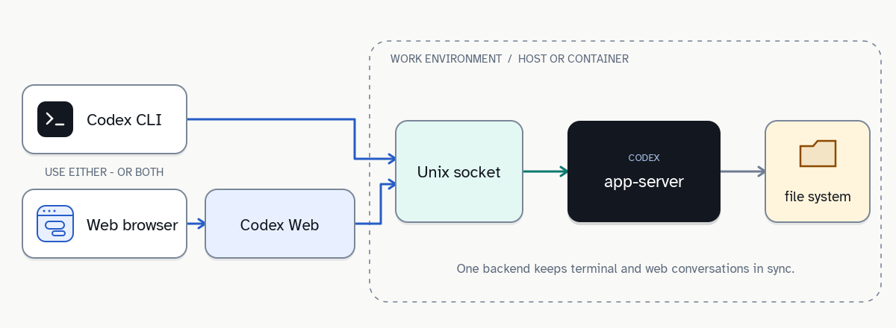

# Codex Web

Use Codex from a terminal, this web UI, or both. Clients connected to the same
app-server share conversations.



## 1. App server

Run app-server where Codex should access files and tools: the host OS, a VS Code
development container, or another container. That environment is where Codex
does the work.

Install and sign in to [Codex CLI](https://developers.openai.com/codex/cli) in
the work environment. App-server is included with the CLI.

```bash
mkdir -p /absolute/shared/path
chmod 700 /absolute/shared/path
rm -f /absolute/shared/path/app.sock
codex app-server --listen unix:///absolute/shared/path/app.sock
```

Keep it running with a service manager. The socket directory must be visible to
each client. App-server is
[experimental](https://developers.openai.com/codex/developer-commands).

## 2. Terminal (optional)

Connect from any shell:

```bash
codex --remote unix:///absolute/shared/path/app.sock
```

For default Bash routing, add this to `~/.bashrc`:

```bash
export CODEX_APP_SERVER_SOCKET=/absolute/shared/path/app.sock
source /absolute/path/to/codex-web/codex-remote.bash
```

`codex`, `resume`, `fork`, `archive`, `delete`, and `unarchive` use app-server.
Other subcommands and `codex-local` use the local executable.

## 3. Web (optional)

With Docker Compose:

```bash
cd /absolute/path/to/codex-web
cp .env.example .env
# Edit .env, including your UID and GID.
docker compose up --build -d
```

Open `http://HOST_IP:8765`.

Without Docker:

```bash
python3 -m venv .venv
.venv/bin/pip install -r requirements.txt
mkdir -p uploads && chmod 700 uploads
ROOT=/absolute/path/to/projects
CODEX_APP_SERVER_SOCKET=/absolute/shared/path/app.sock \
CODEX_DEFAULT_CWD="$ROOT" CODEX_WORKSPACE_ROOT="$ROOT" \
CODEX_UPLOAD_DIR="$PWD/uploads" CODEX_UPLOAD_HOST_DIR="$PWD/uploads" \
HOST=0.0.0.0 PORT=8765 .venv/bin/python app.py
```

## Security

The UI is unauthenticated and listens on all interfaces. Keep it behind a VPN
or firewall.

## Test

```bash
npm ci && npm run build
npm run test:markdown && npm run test:links
npm run test:copy && npm run test:theme
node tests/render.test.js && node --check static/app.js
.venv/bin/python -m unittest discover -s tests -v
docker compose config --quiet
```
