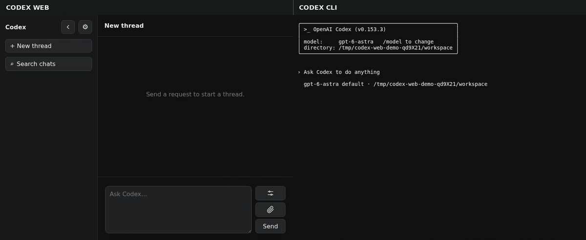

# Codex Web

Use Codex from a terminal, this web UI, or both. Clients connected to the same
app-server share conversations.




## Setup

### 1. App server

Run the app-server where Codex should access files and tools: the host OS, a VS 
Codedevelopment container, or another container. That environment is where Codex
does the work.

Install and sign in to [Codex CLI](https://developers.openai.com/codex/cli) in
the work environment. App-server is included with the CLI.

```bash
mkdir -p /absolute/shared/path
chmod 700 /absolute/shared/path
rm -f /absolute/shared/path/app.sock
codex app-server --listen unix:///absolute/shared/path/app.sock
```

Keep it running with a service manager. The socket directory must be visible to
each client. [`codex app-server` is experimental and unsupported for production
workloads.](https://developers.openai.com/codex/app-server)

### 2. Terminal (optional)

Connect from any shell:

```bash
codex --remote unix:///absolute/shared/path/app.sock
```

So that codex CLI connects to the socket, add this to `~/.bashrc`:

```bash
export CODEX_APP_SERVER_SOCKET=/absolute/shared/path/app.sock
source /absolute/path/to/codex-web/codex-remote.bash
```

`codex`, `resume`, `fork`, `archive`, `delete`, and `unarchive` use app-server.
Other subcommands and `codex-local` use the local executable.

### 3. Web (optional)

A minimal `compose.yaml` using the published image is:

```yaml
services:
  codex-web:
    image: ghcr.io/sjtrny/codex-web:latest
    user: "${CODEX_WEB_UID:-1000}:${CODEX_WEB_GID:-1000}"
    environment:
      CODEX_DEFAULT_CWD: /absolute/path/to/projects
      CODEX_WORKSPACE_ROOT: /absolute/path/to/projects
      CODEX_UPLOAD_HOST_DIR: /absolute/path/to/codex-web/uploads
    ports:
      - "8765:8000"
    volumes:
      - /absolute/shared/path:/run/codex:ro
      - /absolute/path/to/projects:/absolute/path/to/projects:ro
      - ./uploads:/uploads
```

Start it with the host user's UID and GID so the container can access the
app-server socket and upload directory:

```bash
CODEX_WEB_UID="$(id -u)" CODEX_WEB_GID="$(id -g)" docker compose up -d
```

See the provided [`compose.yaml`](compose.yaml) for all configuration options;
[`.env.example`](.env.example) lists the corresponding environment values.

Open `http://HOST_IP:8765`.

### Agent instructions

Codex Web bundles [`codex-web-instructions.md`](codex-web-instructions.md) in
the application image and adds it to `thread/start`, `thread/resume`, and
`thread/fork` requests as app-server developer instructions. These instructions
teach Codex how to retrieve a referenced previous conversation without
resuming it and how this UI renders links to local files and inline local
images.

The bundled file is stored under `/app` in the image. The normal workspace bind
mount targets `/workspaces`, so mounting a user's projects does not replace the
instructions. Project-level `AGENTS.md` files remain separate and are still
discovered by the app-server from each thread's working directory.

Without Docker:

```bash
python3 -m venv .venv
.venv/bin/pip install -r requirements.txt
mkdir -p uploads && chmod 700 uploads
ROOT=/absolute/path/to/projects
CODEX_APP_SERVER_SOCKET=/absolute/shared/path/app.sock \
CODEX_DEFAULT_CWD="$ROOT" CODEX_WORKSPACE_ROOT="$ROOT" \
CODEX_UPLOAD_DIR="$PWD/uploads" CODEX_UPLOAD_HOST_DIR="$PWD/uploads" \
HOST=0.0.0.0 PORT=8765 .venv/bin/python app.py
```

### Reply while Codex works

During an active task, the composer button shows **Stop** when the text box is
empty. Type a message or attach a file to switch it to **Reply**. Send an answer,
correction, or additional instruction without stopping the task. Pressing Enter
in an empty text box does not stop the task.

Open **Model and chat settings** beside the paperclip (**Attach**) to change the model,
reasoning, and other chat options in a modal. Changes are saved for the chat and
apply to the next new turn. Replies use the current task's settings.

**Working folder** is the folder on the Codex server where commands start and
project files are found. It replaces the old `cwd` header input. The field shows
the current path, uses the chat's folder by default, and keeps your changes with
that chat. Clear it to return to the chat's default folder. Changing it does not
move files or affect a task already running.

Settings, Attach, and Send/Reply/Stop are stacked vertically to the right of the text box.

Questions appear as ordinary conversation text. Answer using the same text box
and **Reply** button; there are no separate question cards or answer controls.
The status distinguishes **Waiting for your answer** from **Working — question
pending**. For a native structured request with several questions, answer each
in order through the text box. Chat drafts survive chat switching and temporary
disconnections.

If a task ends before a reply is accepted, the reply remains a draft for you to
send again. Codex Web does not automatically start a new task. Mid-task replies
require an app-server that supports `turn/steer`.

For an isolated desktop/mobile browser check, install the demo's Playwright
dependencies and Chromium with `demo/setup.sh`, then run
`npm run test:browser:questions`. This check uses simulated app-server events
and does not start Codex tasks or change the running service.

### Chat settings defaults

Unset chat settings use these instance defaults. Set them in `.env` for Docker
Compose, or export them when running directly.

| Environment variable | Built-in default |
| --- | --- |
| `CODEX_DEFAULT_MODEL` | `gpt-6-astra` |
| `CODEX_DEFAULT_REASONING_EFFORT` | `medium` |
| `CODEX_DEFAULT_SERVICE_TIER` | empty (standard service) |
| `CODEX_DEFAULT_PERSONALITY` | `none` |
| `CODEX_DEFAULT_REASONING_SUMMARY` | `auto` |
| `CODEX_DEFAULT_APPROVAL_POLICY` | `on-request` |
| `CODEX_DEFAULT_PERMISSION_PROFILE` | `:workspace` |

Example: Sol, max reasoning, Fast, never ask, and full access:

```dotenv
CODEX_DEFAULT_MODEL=gpt-5.6-sol
CODEX_DEFAULT_REASONING_EFFORT=max
CODEX_DEFAULT_SERVICE_TIER=priority
CODEX_DEFAULT_APPROVAL_POLICY=never
CODEX_DEFAULT_PERMISSION_PROFILE=:danger-full-access
```

Values are app-server protocol IDs. Restart the web service after changing them.
The model picker is populated by the app-server's `model/list` response, so keep
Codex CLI current to make newly available models selectable.

## Attachment retention

Uploaded files remain in `CODEX_UPLOAD_STORAGE_DIR` (Docker Compose) or
`CODEX_UPLOAD_DIR` (direct runs), and each attachment in chat history links back
to that retained copy. Retained images also render as inline previews that link
to the original download. Keep this directory when upgrading or recreating the
web service if historical downloads and previews should remain available.

## Security

The UI is unauthenticated and listens on all interfaces. Keep it behind a VPN
or firewall.
